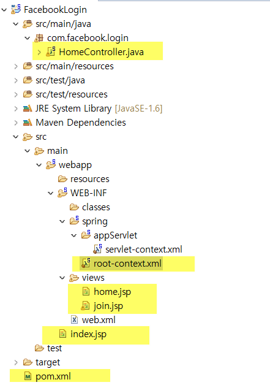

# facebook_login
페북 로그인 API

***

  

***
# pom.xml
```java 
  <!-- 페북 -->
	<dependency>
            <groupId>org.springframework.social</groupId>
            <artifactId>spring-social-facebook</artifactId>
            <version>2.0.3.RELEASE</version>
        </dependency>
	<!-- https://mvnrepository.com/artifact/com.fasterxml.jackson.core/jackson-core -->
	<dependency>
	    <groupId>com.fasterxml.jackson.core</groupId>
	    <artifactId>jackson-core</artifactId>
	    <version>2.9.7</version>
	</dependency>
``` 


# 유의점
- 페북 정책으로 https로만 서비스 이용이 가능 
- 따라서 SSL 인증키를 만들어야 함
https://devhome.tistory.com/64
https://indienote.tistory.com/100

# 유효한 OAuth 리디렉션 URI
https://localhost:8443/login/callback   

# 참고 블로그
https://gdtbgl93.tistory.com/75  
